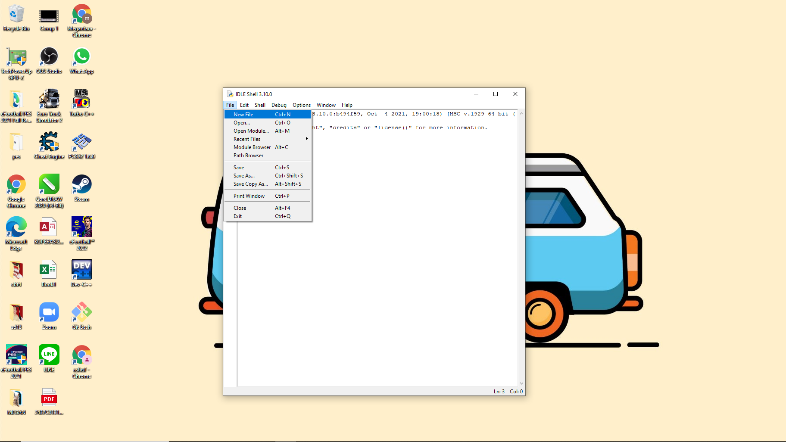

# Latihan 2
## Cara Membuat Program Biodata Dengan Python
## Bahan yang di butuhkan 
 - [Python](https://www.python.org)

### Membuat Program dengan Python

 - Pertama buka <b>"IDLE Python"</b>

 

 - Setelah terbuka klik, File, New file

 

  - Setelah itu Klik (File - Save)
  - Lalu pilih tempat untuk menyimpan file Python "JANGAN LUPA MENGGUNAKAN .py"
  
  
  - Koding sesuai apa yang kalian mau
  

  - Setelah selesai koding, lalu pilih (Run - Run Module) untuk menjalankan program
  

  ## OUTPUT
  
  
## Demikian Pembahasan ini Semoga Bermanfaat
## TerimaKasih
